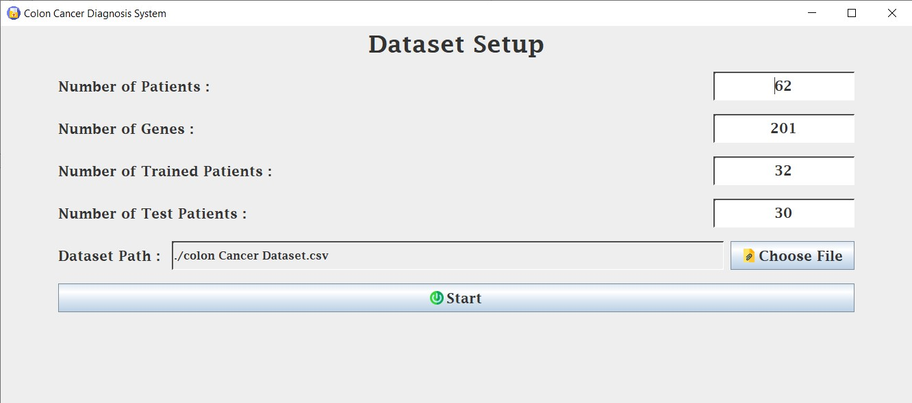
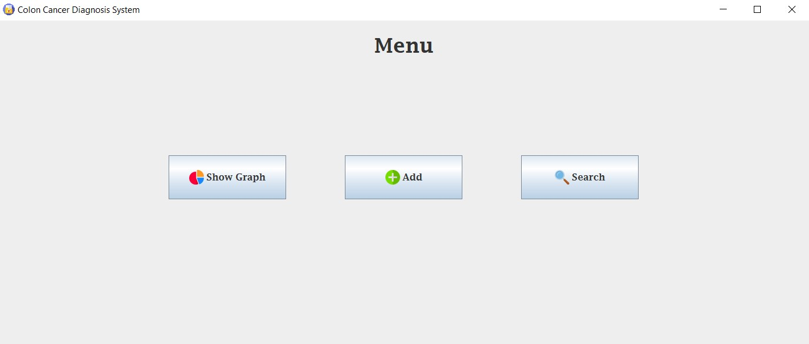

# Colon Cancer Diagnosis System:
A Java based OOP System that Detects whether the Inputted Colon Cell is a Malignant or a Benign Tumor Colon Cell, Based on the Registered Cells Previously Diagnosed.

## Dataset Setup Consists of:
1- Number of Patients. 
2- Number of Genes. 
3- Number of Trained Patients. 
4- Number of Tested Patients. 
5- Dataset File Path.   

## System Features:
1- **Show Graph**: Shows a Pie Graph of the Sample Accuracy and the Percentage of Predicted Conditions. 
2- **Add**: Adds a Patient's Inforamtion to the System. 
3- **Search**: Searches for a Patient in the System to Show the Actual and Predicted Value using the Nearest Neighbour Classification Method.   

## **Nearest Neighbour** Classification Mehtod:
- **First**: Calculate Euclidiean Distance between a Patient from Test Patients and Each Patient in Tratining Patients. 
- **Second**: Pick the Smallest Euclidiean Distance Which refers to the Highest Similatirty. 
- **Third**: If the Patient with Lowest Distance and Highest Similarity is Cancered, then the Tested Patient is also Predicted to be Cancered. And if not, then the Teseted Patient is not Predicted to be Cancered. 
